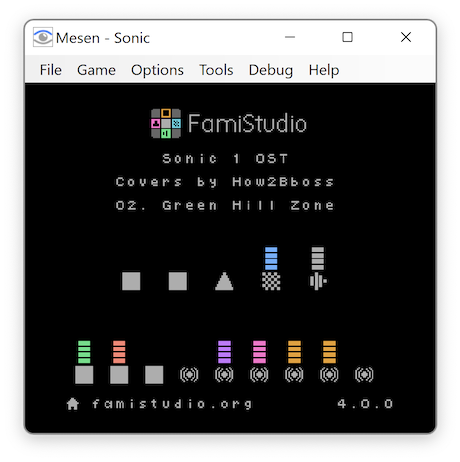

# EPSM
 NES Expansion Port Sound Module (Earlier: Expansion Port Sound Generator)

### An expansion sound card for the Nintendo Entertainment System

It uses an Yamaha YMF288 Soundchip that gives a lot of new audio capabilities to the NES.

## Features of YMF288:
* 3 Pulse Channels with Envelope and Noise
* 6 4OP FM Channels with hard panning stereo.
* 6 Rythm channels featuring 6 different ADPCM Drum Recordings with Hard Panning Stereo support
* 2 Timed IRQ's
## Added features of the EPSM
* Forwards expansion audio from supported gamecarts
  * Original Famicom expansion audio games with compatible adapter
  * PowerPak
  * EverDrive N8
  * EverDrive N8 Pro
  * Other carts using EXP2, EXP6 or EXP9 to output audio
* Alternative 3.5mm jack for Stereo output
  * EPSM Audio forwarding to the NES RCA/RF outputs are disabled when the 3.5mm jack is plugged in
  * NES Audio and Cart Expansion audio plays as Dual Mono on the 3.5mm jack.

## Tools
* Mesen-X: Supports playback of EPSM using any mapper.
* FamiStudio: Allows for music creation for the EPSM and has both ROM and NSF export options.

## Usage
* [Addressing](Docs/Addressing.md)
* [Addressing Fiskbit's Fallback Handler](Docs/Fiskbit-FallbackHandler.md)
* [NESDev wiki](https://www.nesdev.org/wiki/Expansion_Port_Sound_Module)
* [N8 Pro Mappers with EPSM Addressing](Files/N8ProEPSM.zip)